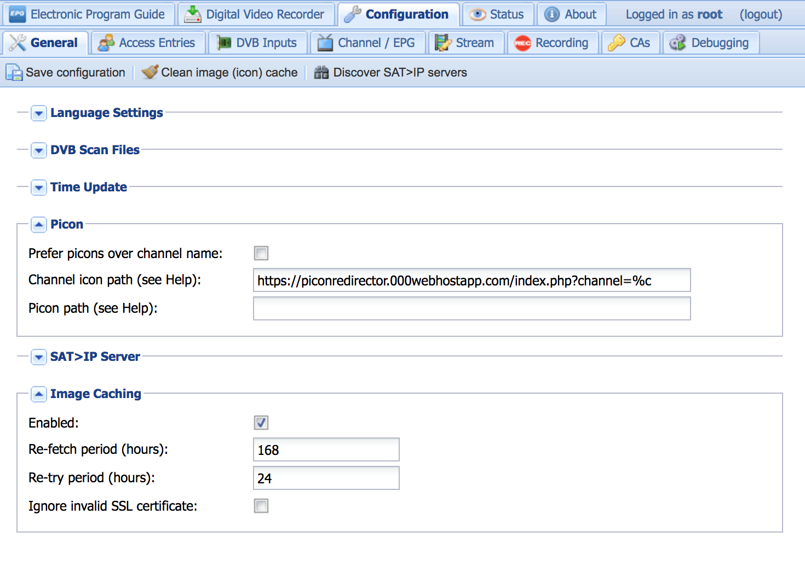

# tvheadend-picon-redirector

Beautiful channel logos in Tvheadend, effortless.

## What?

Tvheadend can serve station logos to clients, if you find a source for it. 

There are several projects collecting these logos, but I found none that offered these logos in a way directly compatible to Tvheadend -- mostly the name patterns are not like Tvheadend can produce them.

This small script fixes this, by transforming the channel name generated by Tvheadend and redirecting to a URL where a matching station logo can be found.

Uses PNG logos from [Enigma2 PiconsUpdater Plugin](https://github.com/gigablue-support-org/templates_PiconsUpdater), but should be easily adoptable to other image sources.

## Installation

- Deploy this [index.php](index.php) anywhere on a PHP capable web server

## TV Headend Configuration:

- Enter `http://your.host.com/path/to/index.php?channel=%c` as `Channel icon path` in Tvheadend config
- Enable Image caching

## For the Lazyweb

I deployed it on the next best free hoster I found, so you can use [https://piconredirector.000webhostapp.com/index.php?channel=%c](https://piconredirector.000webhostapp.com/index.php?channel=%c) if you do not have a PHP server. I do not monitor this URL, so please tell me if it goes down.
But please, enable image caching in Tvheadend.
